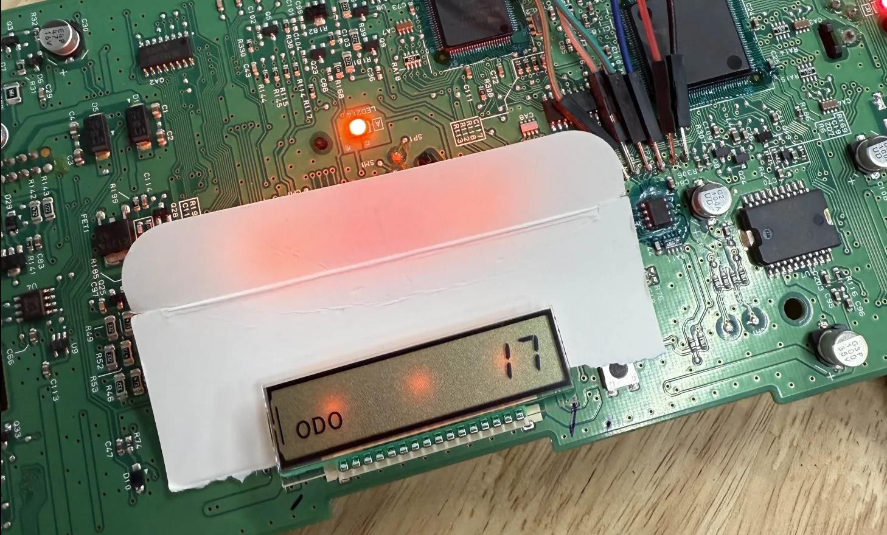

# Yazaki-17

Calculate EEPROM memory values to restore mileage to an instrument cluster storing values using Yazaki-17



## Disclaimer

This project is provided strictly for educational and research purposes. The information shared here is intended to help vehicle owners diagnose, repair, or restore their own instrument clusters, particularly in cases of hardware failure, data corruption, or legitimate mileage restoration (e.g., after cluster replacement).

**Manipulating or tampering with vehicle mileage to misrepresent the true odometer reading is illegal in many countries and jurisdictions. Such actions may constitute fraud and can carry serious legal consequences.**

By using this information, you agree that:

* You are solely responsible for how you apply this knowledge.
* You will only use this information in compliance with all applicable local, state, and federal laws.
* The author of this repository do not condone or support any illegal activity, including odometer fraud.

Always consult your local laws and regulations before proceeding. Opinions expressed are solely my own and do not express the views or opinions of my employer.

## Intro

Long story short I bought a "mechanics special" Toyota Tundra without a transmission temperature gauge, and wanted to monitor how cooked my transmission is without hooking up an OBD2 scan tool every drive. Sure, I could have paid for someone else to 1:1 swap a desired clusters with pre-programmed miles, but then how would I justify buying an EEPROM reader?

While plenty of paid/closed-source calculators exist, information on actually decoding/encoding Yazaki-17 is sparse. Credit to "Zero Cool" for publishing an explanation of their own understanding/translations [1].

The following was completed on a P9348DG cluster removed from a 2010 Toyota Tundra, containing an 93C66 pqEEPROM configured for 16-bit organization. While I am focused on second generation Tundras, a lot of this information will carry over to other vehicles using Yazaki-17 to store the odometer value. I'd recommend picking up an experimental cluster from ebay/salvage yard before bricking your car!

## Calculator

Should run with any install of Python 3, and does not depend on any 3rd party libraries.

Provide an integer as the first argument, get 34 symbol output `python ./calc.py <int>`
```
$ python ./calc.py 488184
Input Distance:      488184
Base Divisor:        0x702c (28716)
Inverse Remainder:   5
Remainder Mask:      0x702d (28717)
Remainder:           12
34 Symbol Output: 

#######################################
702D 702D 702D 702D 702D 702D 702D 702D
702D 702D 702D 702D 702C 702C 702C 702C
702C FFFF FFFF FFFF FFFF FFFF FFFF FFFF
FFFF FFFF FFFF FFFF FFFF 0000 0000 0000
0000 0000
#######################################
```


## Methodology

1. Source a cluster containing features of your desire
2. Use your vehicles service data/workshop manual to identify pins to bench power your sourced cluster
    * You probably only need a ground, a 12V always hot, and a 12V hot when key on
3. Start googling chips until you find the EEPROM and it's datasheet [2]
    * It's probably an 8 pin 150mm SOIC near some type of microprocessor.
    * Try appending `datasheet filetype:pdf` to your Googlin'
4. Connect a serial programmer to the EEPROM *somehow*. 
    * Factory programming pads, desoldering the EEPROM, or a SOIC Test Clip are some options
5. Dump EEPROM
    * Back up the dump before doing ANYTHING else
6. ???
7. Write your modified bytes back to EEPROM
8. Power up cluster and hope it worked :)

## Further Thoughts
I've written this assuming the audience has a basic understanding of reading electronic schematics, used a soldering iron before, and familiar with how binaries/memory work.

There's probably a more elegant/bitmath mechanism for calculating Yazaki-17 than my Python implementation but I ended up here as a side quest to fixing up my clapped out auction truck and was not the primay objective. Fork and be the change you want to see.

This was my first go at hardware research. Find this stuff interesting? Matt Brown offers some incredible, free educational content on YouTube [3]

## Resources
[1] - http://archive.today/2025.08.29-170637/https://www.digital-kaos.co.uk/forums/showthread.php/1032515-Looking-for-2nd-gen-(2010)-Tundra-93C66-Odometer-Programming-Info?p=4585009&viewfull=1%23post4585009

[2] - https://www.mouser.com/datasheet/2/308/CAT93C66-D-69419.pdf

[3] - https://www.youtube.com/@mattbrwn